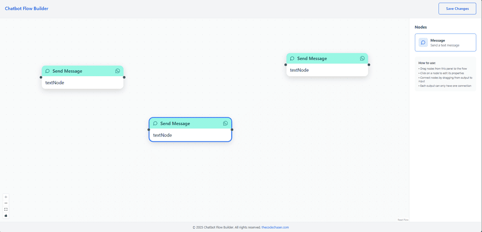
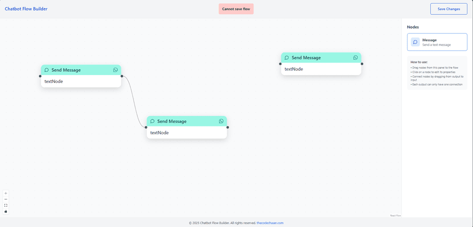
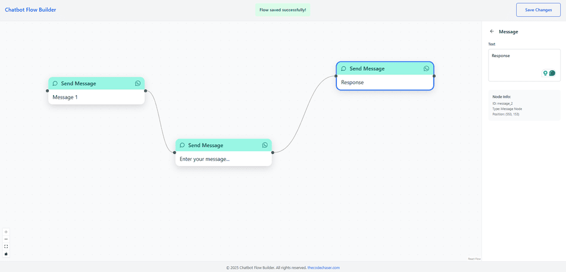

# Chatbot Flow Builder

> Chatbot flow Builder is a visual conversation design tool that empowers users to create custom chatbot flows with ease. Users can add message nodes manually or via drag-and-drop, each with configurable inputs and connections. Nodes can have follow-up branches, enabling deeply nested, conditional conversations. Whether building simple greetings or complex decision trees, Chatbot flow Builder offers a flexible and intuitive interface for designing interactive chat experiences.

## Preview:







## Built With

- HTML
- CSS
- JavaScript
- TypeScript
- React
- React Flow
- Tailwind CSS
- Vite

## Live version

[Chatbot Flow Builder](https://chatbot-flow.thecodechaser.com)

## Getting Started

To get a local copy up and running follow these simple example steps.

### Prerequisites
- A text editor(preferably Visual Studio Code)
- Node
- Web browser

### Install
- [Git](https://git-scm.com/downloads)
- [Node](https://nodejs.org/en/download/)

### Using it Locally

- Clone the project

```bash 
git clone git@github.com:thecodechaser/chatbot-flow-builder.git

cd chatbot-flow-builder
```

- Install dependencies

```bash
npm i 
or
npm install
```
- To Start the development server
```bash
npm run dev
```

- To test the project
```bash
npm run test
```


## Visit And Open Files

[Visit Repo](https://github.com/thecodechaser/chatbot-flow-builder)

## Download Repo

[Download Repo](https://github.com/thecodechaser/chatbot-flow-builder/archive/refs/heads/main.zip)

## Authors

👤 **Ranjeet Singh**

- Website: [thecodechaser.com](https://thecodechaser.com)
- GitHub: [@thecodechaser](https://github.com/thecodechaser)
- Twitter: [@thecodechaser](https://twitter.com/thecodechaser)
- LinkedIn: [thecodechaser](https://linkedin.com/in/thecodechaser)

## 🤝 Contributing

Contributions, issues, and feature requests are welcome!

Feel free to check the [issues page](https://github.com/thecodechaser/chatbot-flow-builder/issues).

## Show your support

Give a ⭐️ if you like this project!

## Acknowledgments

- Inspiration: BiteSpeed

## 📝 License

This project is [MIT](./LICENSE) licensed.
